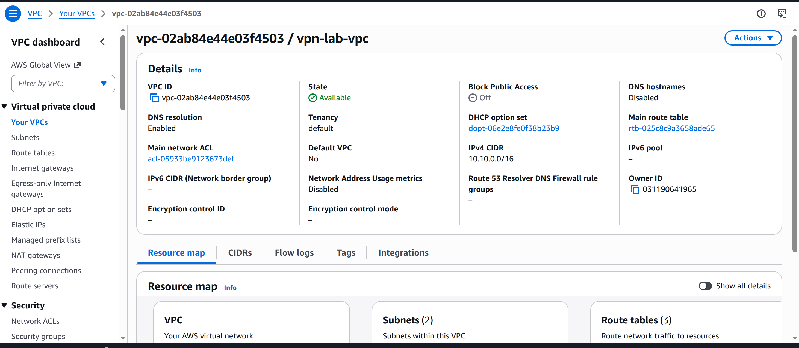
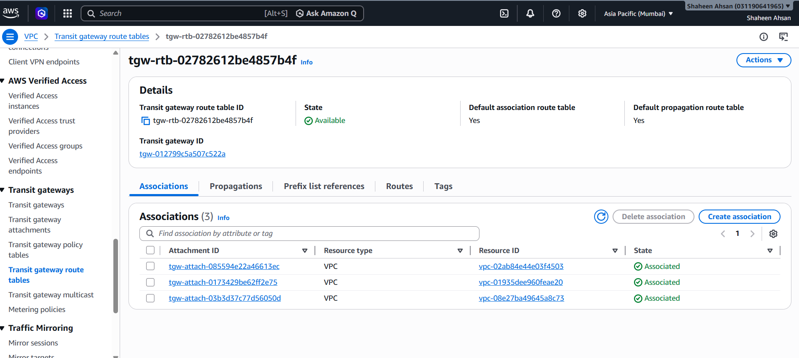
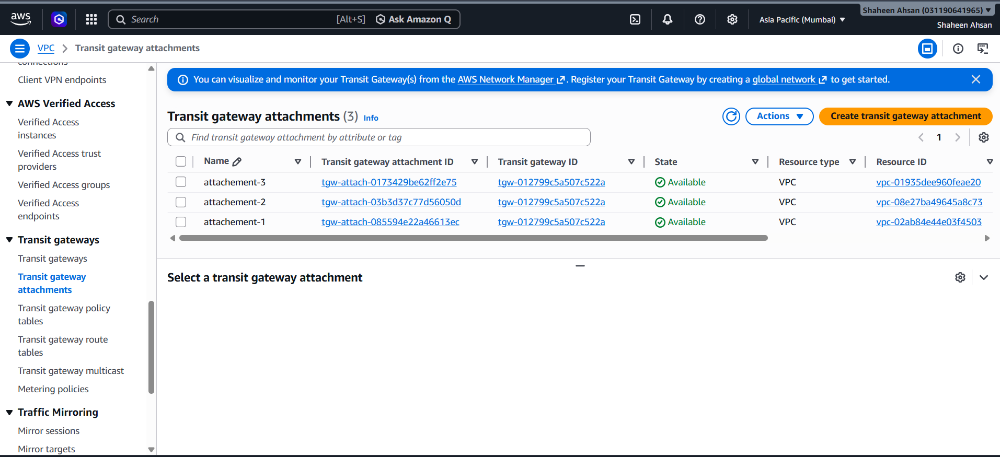

# TRANSIT GATEWAY
## TASK: Create two additional VPC , in other two vpc, create 1 private server each. All three server should be able to ping each other and should be accessible over vpn as well. 

( For this transit gateway task we already have 3 vpcs and in all 3 vpcs we have 4 ec2 servers in vpc-1 we have 2 ec2 1 public ec2 + 1 private ec2, vpc-2 1 private ec2, vpc-3 1 privte ec2

### STEP - 1
Create transit gateway
Create transit gateway rtb

Associate trasit gateway rtb with all 3 rtb

### STEP - 2 
Transit gateway Attachment

attachment-1  vpc-1
attachment-2   vpc-2
attachment-3   vpc-3

### STEP - 3
### ROUTE TABLE
Edit routes
vpc-1-public-rtb = add
Destination: vpc-2 CIDR, vpc-3 CIDR, 
Target: Transit gateway
tgw-012799c5a507c522a
Destination: 0.0.0.0/0
Target: internet gateway
igw-04e4d77564a4f95c5

vpc-1-private-rtb = add
Destination: vpc-2 CIDR, vpc-3 CIDR, 
Target: Transit gateway
tgw-012799c5a507c522a

vpc-2-private-rtb = add
Destination: vpc-1 CIDR, vpc-3 CIDR, 
Target: Transit gateway
tgw-012799c5a507c522a

vpc-3-private-rtb = add
Destination: vpc-1 CIDR, vpc-2 CIDR, 
Target: Transit gateway
tgw-012799c5a507c522a

## STEP - 4
Add ALL EC2 SERVER'S SECURITY GROUP INBOUND IN ALL VPC 

EC2-1  VPC-1 - VPC-2 + VPC-3 CIDR 
ALL ICMP - IPV4

EC2-2  VPC-1 - VPC-2 + VPC-3 CIDR 
ALL ICMP - IPV4

EC2-3  VPC-1 - VPC-2 + VPC-3 CIDR 
ALL ICMP - IPV4

EC2-4  VPC-1 - VPC-2 + VPC-3 CIDR 
ALL ICMP - IPV4

## STEP - 5 
UPDATE ALL VPCS SECURITY GROUP
add all 3 vpc CIDR IN each vpc-sg
vpn-server
private-server-1
private-server-2
private-server-3

associate correct route table with vpc-subnet

### SUBNETS:
public-subnet-vpc-1
private-subnet-vpc-1
private-subnet-vpc-2
private-subnet-vpc-3

